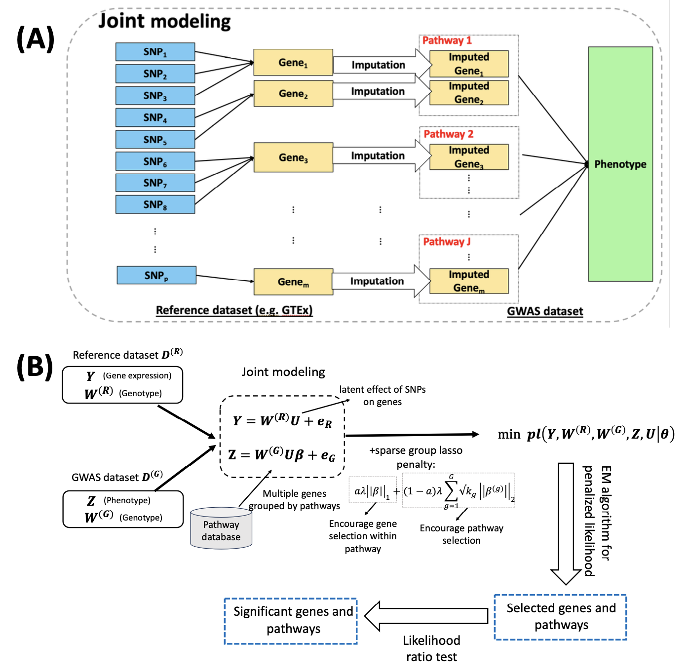

TIPS
===
TIPS package implements a novel multivariate TWAS method that Incorporates Pathway or gene Set information, namely TIPS, and utilized a sparse group lasso penalty to select the most important genes and pathways that contribute to a polygenic trait. Unlike existing univariate TWAS methods that perform association analysis for one gene at a time, TIPS examines multiple genes potentially grouped in biological pathways concurrently, capturing their collective impact on the trait. Such a multivariate pathway guided approach is essential for a comprehensive understanding of the genetic architecture of a complex polygenic trait and revealing the biological processes underlying the trait.



## R Code Overview

The `data_simulation.R` script simulates gene expression and SNP data for various experimental conditions. It provides flexibility in setting noise levels, group sizes, and effect sizes.

Installation
===
To install the TIPS package, you will first need to install devtools package and then execute the following code:
```
#install.packages("devtools")
library(devtools)
install_github("nwang123/TIPS")
```
Usage
===========
The following help page will also provide quick references for TIPS package and the example command lines:
```
library(TIPS)
```

Data
===========
We need the following inputs: w1: genotype data for reference panel (e.g. GTEx); w2: genotype data for GWAS dataset; y: gene expression data for reference panel (e.g. GTEx); z: phenotype data for GWAS dataset. Additionally, we need the pathway information (e.g. pre-saved pathways from KEGG_MSigDB.RData, Reactome.RData and biocarta.RData under data folder) to group the genes.

Implementation steps
===========
1.	We first ran an Expectation-Maximization (EM) algorithm to iteratively estimate model parameters, including gene effects (alpha) and noise variances (sigma1, sigma2, sigmau).
2.	We then ran k-fold cross-validation to tune regularization parameters (lambda and ‘a’) for the optimal choice.
3.	Lastly, we performed likelihood ratio tests for each pathway and each gene and outputted the p-values for their association with the phenotype.

We provide one data example from the GTEx heart tissue and GWAS data for SBP from UK Biobank. Since the size of the original GWAS dataset is too large and there is limits to files size on Github, we split it to chunks and provide the first two chunks as example. If you are interested in the complete data file, please refer to wangneng7877@gmail.com.
```
library(TIPS)
data(y_gene_heart_chu1)
data(w1_heart_chu1)
data(z_heart)
```
w2_heart_chu1 is in.zip file, so the best way to import it is to download the .zip file and unzip it. Then you can import the data in R.
For running a toy simulation example of our package, please run the data simulation example.R code under example folder. 

Output 
===========
The main output of our tool is a list of pathways and genes with p-values from likelihood ratio test for their association with the phenotype of interest. These findings could offer more reliable and interpretable results for TWAS analyses. 

Development
===========
This R package is developed by Neng Wang.
