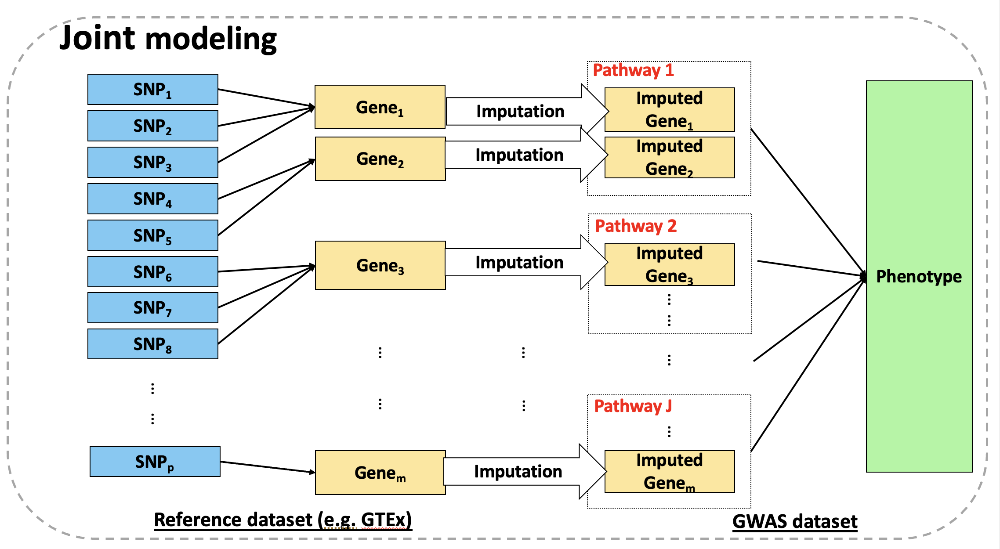

TIPS
===
TIPS is a package for a novel multivariate Twas method that Incorporates Pathway or gene Set information, namely TIPS, and utilized a sparse group lasso penalty to select the most important genes and pathways that contribute to a polygenic trait. Unlike existing univariate TWAS methods that perform association analysis for one gene at a time, TIPS examines multiple genes potentially grouped in biological pathways concurrently, capturing their collective impact on the trait. Such a multivariate pathway guided approach is essential for a comprehensive understanding of the genetic architecture of a complex polygenic trait and revealing the biological processes underlying the trait.



## R Code Overview

The `data_simulation.R` script simulates gene expression and SNP data for various experimental conditions. It provides flexibility in setting noise levels, group sizes, and effect sizes.

Installation
===
To install the `TIPS` package, you will first need to install `devtools` package and then execute the following code: 
```
#install.packages("devtools")
library(devtools)
install_github("nwang123/TIPS")
```
Usage
===========
The following help page will also provide quick references for TIPS package and the example command lines:
```
library(TIPS)
```

Data
===========
There are two data: heart data and brain data. Since the size of the GWAS dataset is too large, we split it to chunks in order to save computation time. There are limitation of files size in Github, so only part of the data is uploaded. If you are interested in the complete data file, please refer to <wangneng7877@gmail.com>.

```
library(TIPS)
data(y_gene_heart_chu1)
data(w1_heart_chu1)
data(z_heart)
```
Since there are .zip file for w2_heart_chu1, the best way to import it is to download the .zip file and unzip it. Then you can import the data in R.

Development
===========
This R package is developed by Neng Wang.
